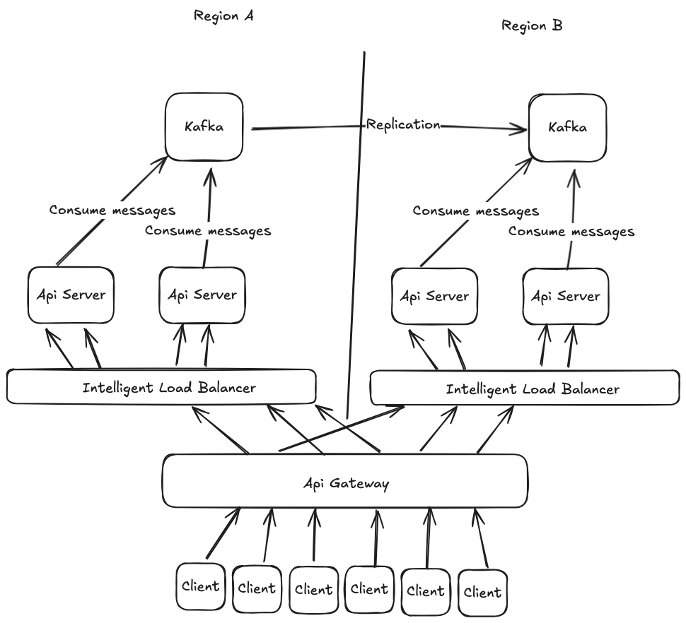

Because our servers read messages from kafka, we can use a service like Amazon MSK Replicator to keep kafka
clusters in multiple regions up to date. We can route requests to a live cluster if an aws region goes down *cough* us-east-1 *cough*

Having our data source in multiple places helps reduce latency for clients who can then connect to servers deployed physically near to them. An api gateway
acts as an entrypoint for clients and routes them to the closest geographic region. Once there, it is sent to an intelligent load balancer. The load balancer
is intelligent because it knows which servers are already consuming messages from the topic that the client request wants to stream. If it knows of a server that
is streaming the desired data and has capcacity, the request is routed to it. This helps us make efficient use of our resources so we don't end up with all servers
reading all topics from kafka.

To keep an eye on our services running in production we can instrument our grpc servers with open telemetry. This exposes metrics like number of requests,
request duration, memory usage, cpu usage. We would want alerts around high failure to connect rates from clients and within our servers if number of connections
becomes too high.

Kafka is not our only choice for pushing data streams to the servers. We could use any pub sub system. For example if we really don't care about durability and
just want live data sent as fast as possible, redis pub sub could be swapped in here